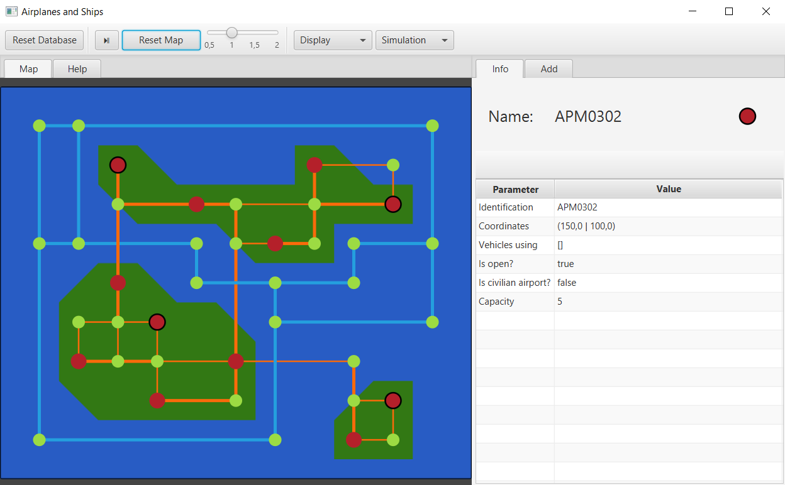
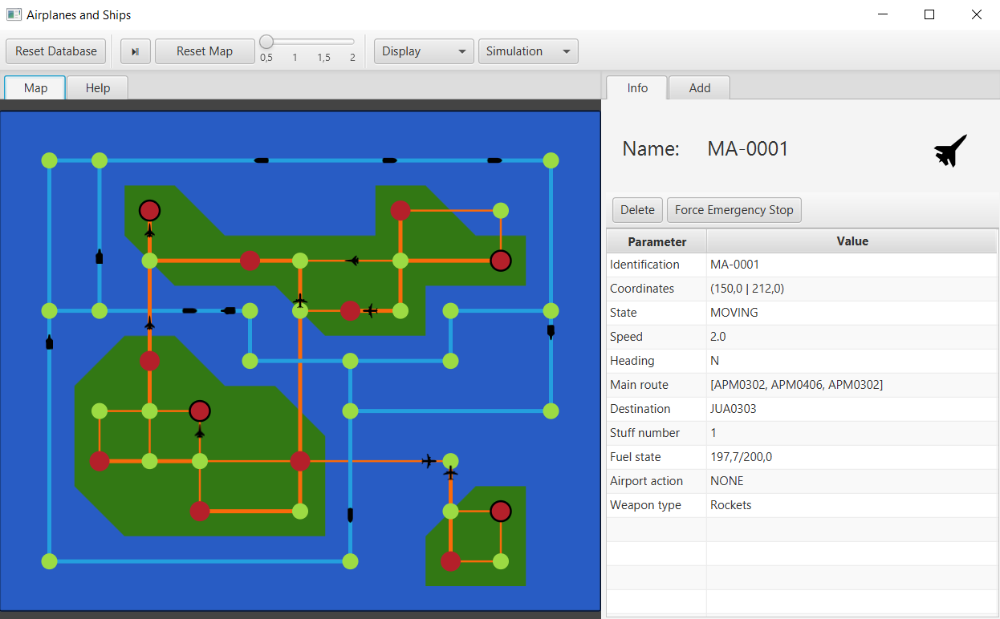
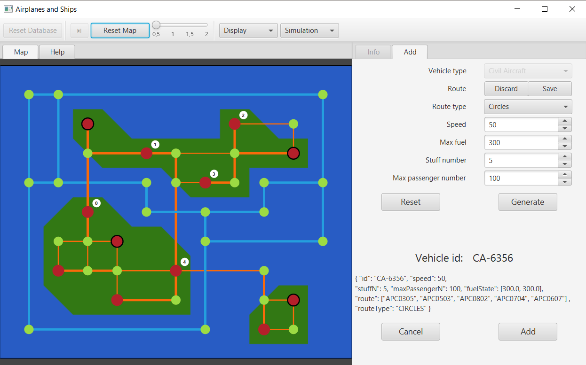

# PP-PO-java-project
GUI application for displaying and controlling plane and ship traffic.

## Instruction
* To initialise the application, press the `Init Database` button located in the upper left corner of the window.
* Resetting the map and adjusting it to the extended window takes place after pressing the `Reset Map` button.
* The slider at the top of the app is responsible for adjusting the speed of the simulation.
* Further information can be found in the `Help` tab. 

### Different displaying option

### Controlling the parameters of airplanes

### Adding new airplane

